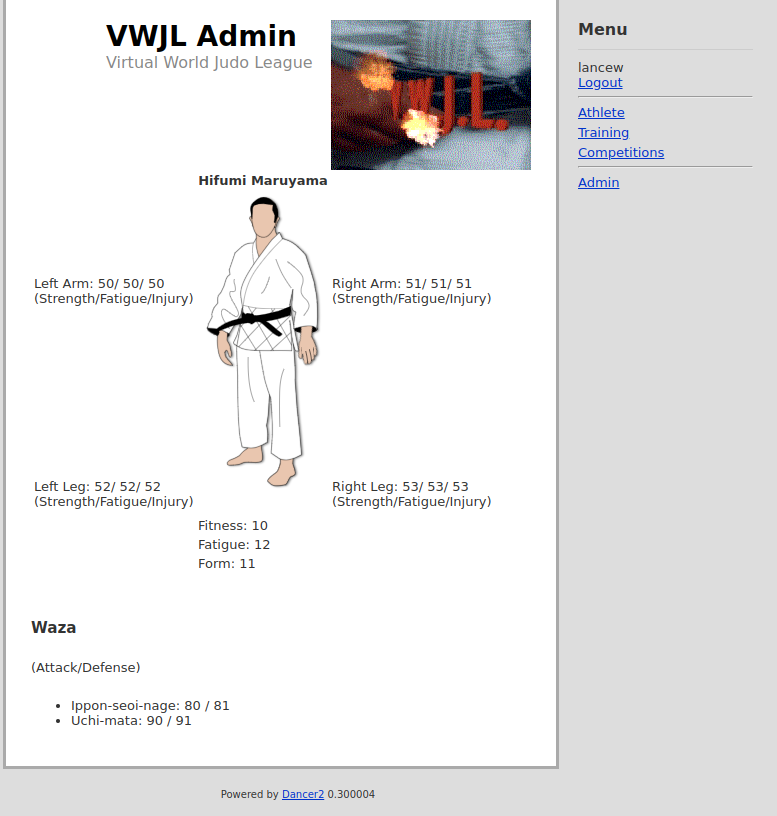
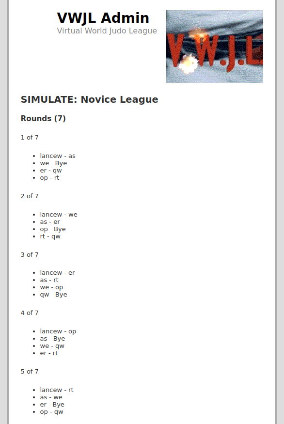

# Virtual World Judo League (VWJL).





## Install dependencies:
 ```carton install```

## Run the app:
 ```DB_RAISEERROR=1 DB_SOURCE="dbi:Pg:dbname=postgres;host=localhost" DB_USERNAME=postgres DB_PASSWORD="somePassword" carton exec plackup -R lib,views bin/app.psgi``` (-R lib,views for reload)

## Access the app via:
 http://localhost:5000

## Run perlcritic
 ```carton exec perlcritic -3 lib/vwjl.pm```

## Run Perltidy
 ```carton exec perltidy lib/vwjl.pm```


## Database
second attempt by following:
* https://dev.to/shree_j/how-to-install-and-run-psql-using-docker-41j2
* docker run --name postgresql-container -p 5432:5432 -e POSTGRES_PASSWORD=somePassword -d postgres

### Formatting
* Currently using http://www.dpriver.com/pp/sqlformat.htm to get consistent SQL formatting.

### Killing the DB
(This is a bit rubbish and a better docker setup required)

* docker ps
* docker kil xxxxxxxxx
* docker system prune -f

You can restart the postgres container (day after a reboot) with: ```docker restart postgresql-container```

Then you can start with docker run as above.


## Installation (ubuntu server)
* Perl obviously
* make (nneded for some modules): ```apt install make```
* gcc: ``apt install gcc```
* postgres libs: ```apt-get install libpq-dev``` or extra/postgresql-libs on Arch/Manjaro
* ssl stuff: ```apt-get install zlib1g-dev```
* more ssl: ```apt-get install libssl-dev```
* cpanm ```apt update; apt install cpanminus```
* carton ```cpanm Carton```
* clone the repo: ```git clone https://github.com/lancew/vwjl.git```
* ```cd vwjl```
* Install modules: ```carton install```


## DO Hacks while building it up

I've hacked up a script to redirect, call it on DO with:

```carton exec plackup bin/redirect.psgi --port 80```

Running with SSL on DO:

```DB_RAISEERROR=0 DB_SOURCE="dbi:Pg:dbname=xxxxxxxx;host=xxxxxxxx;port=xxxxx" DB_USERNAME=xxxxxxx DB_PASSWORD="xxxxxxxx" carton exec plackup -R lib,views bin/app.psgi --enable-ssl --ssl-key-file=/etc/letsencrypt/live/www.vwjl.net/privkey.pem --ssl-cert-file=/etc/letsencrypt/live/www.vwjl.net/fullchain.pem --port 443```


## TODO

* [ ] /ranking - Athletes by wins
* [ ] email sending?
* [ ] extend the simulator to be more of a sequence of hajime-mate 
* [ ] extend the traning options (specifically we need some recovery for fatigue
* [ ] prize money for top 3 (top 5) ?
* [ ] trash talking?


